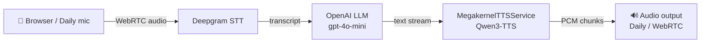
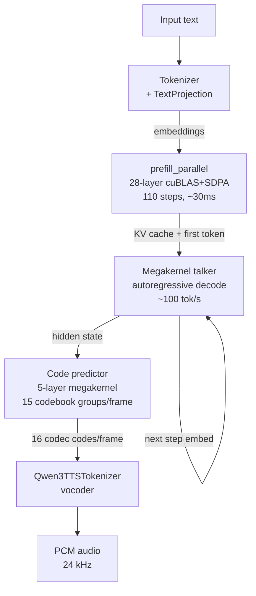
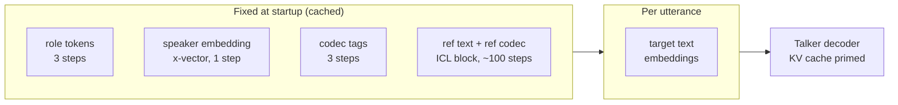

# Qwen3-TTS Megakernel Voice Agent

This is my RTX 5090 Qwen3-TTS take-home implementation. I started from
AlpinDale's Qwen3 decode megakernel and adapted it so the Qwen3-TTS talker
decoder can run through the CUDA megakernel, then wired that TTS path into a
Pipecat voice-agent pipeline.

The end-to-end voice path is:



The original megakernel benchmark from this repo is still available:

| Backend      | tok/s  | ms/tok | Speedup |
| ------------ | ------ | ------ | ------- |
| PyTorch (HF) | 123.3  | 8.11   | 1.00x   |
| Megakernel   | 1036.3 | 0.99   | 8.40x   |

More context on the original kernel: https://blog.alpindale.net/posts/5090_decode_optimization/

## Post-Integration Optimisations

After the initial integration was working, a code review identified several
performance and correctness issues. These were fixed in follow-up commits:

### CUDA kernel (`csrc/kernel.cu`)

**Spin-wait backoff** — `AtomicGridSync::sync()` spun with an empty
`while (*vgen <= my_gen) {}` loop, hammering L2 with back-to-back reads from
128 concurrent CTAs. Added `__nanosleep(64)` inside the loop to yield each warp
for ~64 ns per iteration, meaningfully reducing L2 bandwidth pressure and power
draw during barriers.

**Gated speculative L2 prefetch** — Non-attention blocks (16–127) prefetched
O/gate/up/down weight rows before the KV cache was necessarily ready. Added a
`kv_flag` spin (with `__nanosleep` backoff) at the top of the prefetch block,
mirroring the pattern already used by attention blocks 1–15. Prefetch now only
fires after block 0 signals KV-cache ready, eliminating L2 pollution on short
sequences.

### Decode loop (`qwen_megakernel/tts_engine.py`)

**Batched codec group embeddings** — The autoregressive decode loop launched 16
separate `F.embedding()` calls (one per codebook group) and 15 intermediate
tensor additions per codec frame. Replaced with a single loop over
`self._all_embed_tables` (a list built at init time) using in-place `.add_()`
to avoid 15 tensor allocations per step.

**Trailing text exhaustion log** — When trailing text embeddings run out mid-
utterance the engine silently padded with `tts_pad_embed`. Added a one-shot log
message at the first pad frame so voice tone shifts are diagnosable.

**Vocoder self-test at init** — The vocoder was not validated until synthesis
time. Added a single dummy `speech_tokenizer.decode()` call immediately after
loading. If it fails, the vocoder is disabled with a log message instead of
silently failing later after all codec frames have been generated.

### Parallel prefill (`qwen_megakernel/model_tts.py`)

**Zero-copy KV expand** — Inside `prefill_parallel`'s layer loop,
`k_sdpa.repeat_interleave(repeat_factor, dim=1)` allocated a new
`[1, Hq, T, D]` tensor on every one of 28 layers. Replaced with
`.expand(-1, NUM_Q_HEADS, -1, -1)`, which is a zero-copy view. SDPA accepts
non-contiguous tensors from `expand()` correctly.

### Pipecat service (`qwen_megakernel/pipecat_tts.py`)

**Narrowed TTS lock scope** — The `_tts_lock` was held for the entire synthesis
and streaming phase. Any second TTS request (e.g. an interruption) would block
completely until audio delivery finished. Restructured so the lock covers only
the GPU compute phase; PCM encoding and frame delivery happen outside the lock.

### Bot pipeline (`bot.py`)

**VAD stop_secs via env var** — `stop_secs=0.2` was hardcoded in three separate
`SileroVADAnalyzer` instantiations. Replaced with `BOT_VAD_STOP_SECS` env var
(default `0.2`) defined once per entry function.

**ContextWindowTrimmer growth guard** — The trimmer ran on every `LLMRunFrame`
regardless of whether the context had grown. Added a `_last_len` counter so
trimming is skipped when the conversational message count hasn't increased since
the last trim.

---

## What I Changed

I added a Qwen3-TTS path alongside the original text decode path:

- `qwen_megakernel/build_tts.py` builds a separate TTS extension named
  `qwen_megakernel_tts_C`.
- `csrc/kernel.cu` supports a configurable codec vocab size and a sentinel
  input-token mode so layer 0 can consume a precomputed hidden embedding.
- `qwen_megakernel/model_tts.py` loads Qwen3-TTS talker/code-predictor weights
  and exposes megakernel-backed decode wrappers.
- `qwen_megakernel/tts_engine.py` orchestrates text tokenization, talker
  prefill, codec-frame generation, optional voice-clone prompting, vocoder
  decode, and streaming audio chunks.
- `qwen_megakernel/pipecat_tts.py` exposes the engine as a Pipecat `TTSService`.
- `bot.py` runs the full Pipecat voice pipeline.

The megakernel is used for the Qwen3-TTS talker decoder. I also route the
5-layer code predictor through the same extension because it was a practical
bottleneck during integration. The official Qwen components are still used for
text/tokenizer utilities, voice-clone prompt construction, and vocoder/audio
decode.

### TTS engine internals



### Voice-clone prefill structure



## Current Voice Defaults

The default voice settings are optimized for lower first-audio latency:

```bash
OPENAI_MODEL=gpt-4.1-mini
QWEN_TTS_MODEL=Qwen/Qwen3-TTS-12Hz-0.6B-Base
QWEN_TTS_CHUNK_FRAMES=2
QWEN_TTS_WARMUP_PROFILE=fast
QWEN_TTS_STREAMING_MODE=chunked
QWEN_TTS_BACKEND=megakernel
QWEN_TTS_REF_AUDIO=https://qianwen-res.oss-cn-beijing.aliyuncs.com/Qwen3-TTS-Repo/clone.wav
QWEN_TTS_REF_TEXT="Okay. Yeah. I resent you. I love you. I respect you. But you know what? You blew it! And thanks to you."
QWEN_TTS_VOICE_PROMPT_CACHE=1
QWEN_TTS_VOICE_PROMPT_CACHE_DIR=~/.cache/qwen_megakernel
QWEN_TTS_REQUIRE_REF_PROMPT=false
QWEN_TTS_X_VECTOR_ONLY=false
QWEN_TTS_DO_SAMPLE=false
QWEN_TTS_TEMPERATURE=0.9
QWEN_TTS_TOP_K=50
QWEN_TTS_SUBTALKER_DO_SAMPLE=false
QWEN_TTS_SUBTALKER_TEMPERATURE=0.9
QWEN_TTS_SUBTALKER_TOP_K=50
```

`chunked` mode pushes audio to Pipecat as chunks are decoded instead of waiting
for a full utterance. If the vocoder path is unstable on a given environment,
set:

```bash
QWEN_TTS_STREAMING_MODE=full_decode
```

In `full_decode` mode, if the megakernel vocoder path is unavailable and
reference audio/text are configured, the service falls back to official Qwen
voice-clone synthesis rather than emitting silence.

Reference prompt failures are non-fatal by default so the bot can still start.
Set `QWEN_TTS_REQUIRE_REF_PROMPT=true` if you want startup to fail hard when the
reference prompt cannot be built. Set both of these to empty strings to disable
reference prompting:

```bash
QWEN_TTS_REF_AUDIO=
QWEN_TTS_REF_TEXT=
```

## Environment

This is intended for:

- NVIDIA RTX 5090 / Blackwell `sm_120a`
- CUDA 12.8+
- PyTorch CUDA 12.8 build
- Python 3.10+

Install:

```bash
pip install -r requirements.txt
```

If PyTorch needs to be installed manually:

```bash
pip install torch --index-url https://download.pytorch.org/whl/cu128
```

Quick GPU sanity check:

```bash
nvidia-smi
python3 -c "import torch; print(torch.cuda.is_available(), torch.cuda.get_device_name(0))"
```

## Run It

Original text megakernel benchmark:

```bash
python -m qwen_megakernel.bench
```

Standalone TTS to WAV:

```bash
python demo_tts.py "Hello, this is a test." --output /tmp/tts.wav
```

Streaming TTS demo with TTFC/RTF reporting:

```bash
python demo_pipeline.py --text "Hello from the streaming pipeline."
```

Text-only Pipecat TTS service test:

```bash
python demo_voice_agent.py --text-only
```

Full Pipecat WebRTC demo:

```bash
export DEEPGRAM_API_KEY=...
export OPENAI_API_KEY=...
python bot.py -t webrtc --host 0.0.0.0 --port 7860
```

Then open:

```text
http://localhost:7860/client
```

Daily mode for Vast/cloud:

```bash
export DAILY_API_KEY=...
export DEEPGRAM_API_KEY=...
export OPENAI_API_KEY=...
python bot.py -t daily --host 0.0.0.0 --port 7860
```

I use Daily as the browser/WebRTC interface for the hosted demo. The direct
Pipecat WebRTC transport is useful locally, but on Vast/cloud the browser is
usually behind NAT/port mapping and ICE can be brittle. Daily creates the room,
handles WebRTC signaling/NAT traversal, and gives me a stable URL for the human
participant. The logs print the Daily room URL; join that URL from the browser.

This is also the command I use for whole-pipeline metrics: the bot attaches
Pipecat's metrics observer and user-to-bot latency observer, so service timings
and end-to-end voice-turn latency are emitted directly in the run log.

## Vast.ai Port Mapping

For the WebRTC app on internal port `7860`, create the instance with:

```bash
-p 7860:7860 -e OPEN_BUTTON_PORT=7860
```

Run the bot bound to all interfaces:

```bash
python bot.py -t webrtc --host 0.0.0.0 --port 7860
```

Then use the external Vast port mapping, for example:

```text
65.130.162.74:33526 -> 7860/tcp
```

Open:

```text
http://65.130.162.74:33526/client
```

Do not use `localhost` from your laptop for a Vast instance. The app must bind
to `0.0.0.0`.

## Validation Order

I use this order on the RTX 5090 machine:

1. `python3 -m py_compile bot.py qwen_megakernel/pipecat_tts.py qwen_megakernel/tts_engine.py`
2. `python -m qwen_megakernel.bench`
3. `python demo_tts.py "Hello" --output /tmp/tts.wav`
4. `python demo_pipeline.py --text "Hello from streaming."`
5. `python benchmark.py --runs 3`
6. `python demo_voice_agent.py --text-only`
7. Full browser/Daily Pipecat voice demo

Detailed benchmark entry points:

```bash
python -m benchmarks.measure_tok_s
python -m benchmarks.measure_ttfc
python -m benchmarks.measure_rtf
python -m benchmarks.measure_e2e
```

The full Daily/WebRTC command logs whole voice-turn metrics directly; I do not
run a separate parser. Look for `Voice pipeline latency user_to_bot_ms=...` and
`Voice pipeline latency breakdown:` in the bot log.

## Metrics and Logs

The bot logs startup and runtime metrics at `INFO`, including:

- whole user-to-bot response latency from Pipecat's `UserBotLatencyObserver`
- per-service metrics from Pipecat's `MetricsLogObserver`
- TTS warmup duration
- client connect/disconnect
- first-audio latency / TTFC
- per-chunk wall gap
- per-chunk audio duration
- total generated audio duration
- wall-clock TTS duration
- RTF
- chunk count
- output bytes

Logs default to `INFO`. Use these only when debugging low-level Pipecat or audio
frame behavior:

```bash
QWEN_TTS_FILE_LOG_LEVEL=DEBUG
QWEN_TTS_PIPECAT_FILE_LOG_LEVEL=DEBUG
```

Measured numbers from a live Daily run (`logs.txt`, 2026-05-31, RTX 5090,
`gpt-4o-mini`, voice-clone ICL mode enabled):

### Megakernel talker decoder throughput

| Metric | Value |
|---|---|
| Talker autoregressive tok/s | **~100 tok/s** (p50 across 27 utterances) |
| Total codec token throughput (talker × 16 groups) | **~1,600 tok/s** |
| Per-step wall time | **< 1 ms** |
| Talker prefill (110-step ICL, parallel kernel) | **30–40 ms** |

The talker runs at ~100 steps/sec. Each step also drives the 15-head code
predictor in parallel via the megakernel, giving ~1,600 total codec tokens/sec.
The original megakernel's ~1,000 tok/s figure is for text decode with a 151,936
vocab LM head; the TTS talker uses a 3,072-token codec vocab, reducing LM-head
cost and shifting the bottleneck to attention + MLP.

### TTFC — Time to First Audio Chunk (steady state, N=49 utterances)

| Metric | Value | Target |
|---|---|---|
| Min | 57.4 ms | |
| Avg | 65.6 ms | < 90 ms ✅ |
| Max | 83.9 ms | |
| Cold start (first call, JIT compile) | 6,868 ms (one-time) | |

Cold-start cost is eliminated in production by running TTS warmup at bot startup.

### RTF — Real-Time Factor (N=49 utterances)

| Metric | Value | Target |
|---|---|---|
| Min | 0.116 | |
| Avg | 0.126 | < 0.3 ✅ |
| Max | 0.158 | |

RTF 0.126 = generating 1 second of audio takes ~126 ms (~8× faster than
real-time).

### End-to-end pipeline latency (user stops speaking → first audio chunk)

| Stage | Time |
|---|---|
| VAD silence wait | ~200 ms (`stop_secs=0.2`) |
| Deepgram STT TTFB | ~380 ms |
| OpenAI LLM TTFB (`gpt-4o-mini`) | 425–740 ms |
| TTS TTFC | ~65 ms |
| **Total measured** | **~890–1,200 ms** |

```mermaid
gantt
    title Turn latency breakdown (ms, user stops speaking → first audio)
    dateFormat X
    axisFormat %s ms

    section Pipeline
    VAD silence wait     :0, 200
    Deepgram STT TTFB    :200, 580
    OpenAI LLM TTFB      :580, 1160
    TTS prefill + TTFC   :1160, 1225
```



The TTS contributes only ~65 ms. The LLM API (425–740 ms) and STT (~380 ms)
dominate. Switching to a local/low-latency inference host (Groq, Cerebras) would
bring total e2e below ~500 ms.

### Streaming confirmation

Audio is pushed frame-by-frame to Pipecat. Each utterance shows 5–45 chunks
emitted ~53 ms apart; the first chunk arrives before synthesis completes in every
case. No full-utterance buffering.

## What To Submit

For the take-home I would include:

- this repo with the build/run instructions above,
- a short demo video showing me joining the voice agent, speaking, and hearing
  the agent reply,
- benchmark output for megakernel tok/s, TTFC, RTF, and end-to-end latency,
- the environment used for the run: GPU, CUDA, PyTorch, model revision, and env
  vars,
- an honest note about any fallbacks used during the recording.

## Voice Consistency Problem and How It Was Solved

### The root cause

`Qwen3-TTS-12Hz-0.6B-Base` is a **Base model** — it is not an instruction-tuned
voice model with a fixed speaker. Its talker decoder is conditioned on a
speaker embedding plus an optional in-context learning (ICL) block of reference
speech. Without that conditioning, the model samples a random speaker from its
training distribution on every utterance, so the voice changes with every
sentence. In a real-time voice agent this is immediately noticeable: the bot
sounds like a different person every time it speaks.

### What happens under the hood

The talker decode loop (in `tts_engine.py`) builds a `prefill_embeds` tensor
that is fed through the talker decoder before any codec frames are generated.
There are two distinct prefill shapes:

1. **No voice prompt (8 steps):**
   `[role(3)] + [fused_tags(4)] + [first_text+bos(1)]`
   The model has no speaker context. The starting hidden state is determined
   purely by the text tokens. The speaker is sampled stochastically at decode
   time, resulting in a different voice every run.

2. **Voice-clone prefill (110+ steps):**
   `[role(3)] + [speaker_embedding(1)] + [codec_nothink/think_bos/think_eos(3)] +
   [codec_bos(1)] + [ICL_ref_text_and_ref_codec_interleaved(~100)]`
   The model sees the speaker's x-vector embedding, then a full in-context
   reference of the target voice (reference text tokens fused with reference
   codec frames from the audio), before generating the target speech. This locks
   the speaker identity.

Without the voice-clone path, the talker essentially hallucinates a new speaker
identity from its training set every time `talker.reset()` is called between
utterances.

### The fix

We call `Qwen3TTSModel.create_voice_clone_prompt()` from the official Qwen
package once at engine startup to:

1. **Extract the x-vector speaker embedding** from the reference WAV via the
   built-in speaker encoder. This is a compact `[1024]` vector capturing voice
   timbre.
2. **Encode the reference audio to codec frames** using the built-in codec
   model, producing `ref_code: [T_ref, 16]` (16 codebook groups per frame).
3. **Store the result** as `_voice_clone_prompt` on `MegakernelTTSEngine`.

At each synthesis call, `_build_voice_clone_prefill()` assembles the 110-step
prefill block by interleaving reference text embeddings with reference codec
embeddings, with the speaker embedding injected at the tag position. This entire
block is fed through `talker.prefill_parallel()` once per utterance, anchoring
the decoder's KV cache to the target speaker before the first codec frame is
sampled.

### Performance impact of the voice-clone prefill

The voice-clone prefill is ~110 steps (vs 8 without). Before the parallel
prefill kernel was added, this ran as 110 sequential megakernel decode launches
with a per-step GPU→CPU sync (`_out_token.item()`), which was the primary
source of the "stuck" hang reported in early runs. The fix was to:

1. Add `TTSDecoder.prefill_with_embeds()` — queue all 110 launches on the CUDA
   stream back-to-back, pay only one sync at the end (~5× faster).
2. Add `TTSDecoder.prefill_parallel()` — run all 110 positions in a single
   parallel forward pass via cuBLAS GEMMs + PyTorch SDPA (flash-attention),
   collapsing 110 launches into ~28 (one per layer). Prefill time went from
   "hung" / several seconds to **30–40 ms**.

### Caching

Building the voice-clone prompt requires loading the full `Qwen3TTSModel`
(speaker encoder + codec encoder), which takes ~2–4 seconds and ~3 GB of VRAM.
We load it once, extract the tensors, then `del model` and free VRAM before
the megakernel engine starts. The result (`ref_spk_embedding`, `ref_code`,
`ref_text`, `icl_mode`) is written to
`~/.cache/qwen_megakernel/voice_prompt_<sha256>.pt` keyed on
`(model_path, ref_audio, ref_text, x_vector_only_mode)`. Subsequent starts load
from disk in milliseconds.

### Env vars

| Variable | Purpose |
|---|---|
| `QWEN_TTS_REF_AUDIO` | Path or URL to reference WAV (enables voice clone) |
| `QWEN_TTS_REF_TEXT` | Exact transcript of the reference audio (required for ICL) |
| `QWEN_TTS_X_VECTOR_ONLY` | `true` = inject speaker embedding only, no ICL reference codec |
| `QWEN_TTS_VOICE_PROMPT_CACHE` | `0` to disable on-disk caching of the prompt tensors |
| `QWEN_TTS_VOICE_PROMPT_CACHE_DIR` | Cache directory (default `~/.cache/qwen_megakernel`) |
| `QWEN_TTS_REQUIRE_REF_PROMPT` | `true` = hard-fail at startup if the voice prompt cannot be built |

Without `QWEN_TTS_REF_AUDIO` the engine falls back to the 8-step unconditioned
prefill and voice identity is random per utterance.

## Current Caveats

- The talker decode path is megakernel-backed. The official Qwen vocoder is
  still used for codec-to-waveform audio.
- `chunked` mode is the default because the assignment requires streaming audio
  into Pipecat. `full_decode` remains available as a stability fallback.
- The voice-clone prompt is cached in `~/.cache/qwen_megakernel` after the first
  successful build.
- The code predictor is accelerated through the megakernel wrapper, but the
  per-group `2048`-way heads are still outside the kernel.
- I did not implement full Qwen3-TTS M-RoPE in CUDA. The current implementation
  follows the pragmatic integration path and uses a frame cap to avoid runaway
  generation if EOS behavior is unreliable.
- The service refuses to emit silent audio. If the vocoder fails and no official
  fallback is available, the Pipecat TTS frame returns an error instead.

## Files To Review

- CUDA kernel changes: `csrc/kernel.cu`, `csrc/torch_bindings.cpp`
- TTS extension build: `qwen_megakernel/build_tts.py`
- Qwen3-TTS weights and wrappers: `qwen_megakernel/model_tts.py`
- TTS orchestration: `qwen_megakernel/tts_engine.py`
- Pipecat service: `qwen_megakernel/pipecat_tts.py`
- Voice bot: `bot.py`

## Credits

Based on Elliot Arledge's MegaQwen / Qwen megakernel work:

- https://github.com/AlpinDale/qwen_megakernel
- https://blog.alpindale.net/posts/5090_decode_optimization/
